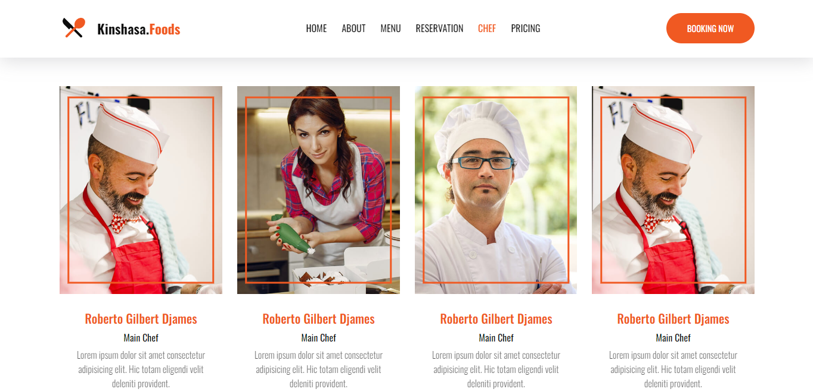

# Restaurant-Website

Un modèle dynamique et polyvalent pour les restaurants qui recherchent un site web pour promouvoir leurs produits et services. Il utilise HTML5 pour le contenu, CSS3 pour le style et SASS pour la mise en page. Vous pouvez ajouter des images, des articles et des fonctionnalités supplémentaires en fonction des besoins de votre restaurant.

Live Site URL :  https://restaurantwebtemplate.netlify.app/index.html

## Points forts

- Interface simple et intuitive pour une navigation facile.
- Contrôle total sur le style, le look et le contenu pour correspondre à vos propres besoins.
- Des modules flexibles et faciles à personnaliser.
- Des formes interactives pour la prise de commandes et les demandes de réservation en ligne.
- Des animations pour rendre le site plus attrayant et engageant.
- Des liens vers les pages des médias sociaux.
- Utilise SASS pour générer des fichiers CSS à moindre coût.

## Installation Vous pouvez télécharger ce projet sur GitHub et le modifier pour répondre à vos besoins.

### Prérequis Vous devez disposer des logiciels suivants pour modifier ce projet:

- [SASS](https://sass-lang.com/install)

### Installation

Pour obtenir une copie du projet et le modifier, téléchargez le fichier ZIP ou clonez le dépôt. Pour modifier le style et les variables SASS, ouvrez le fichier ".scss" et modifier les variables et le style à votre guise.

## Auteur

Ce projet a été conçu par Bope142. J'espère que ce modèle répondra à vos attentes pour lancer votre site web de restaurant. Si vous avez des questions, n'hésitez pas à me contacter. N'hésitez pas à laisser une note sur la page principale si vous l'avez apprécié... Merci beaucoup!.

